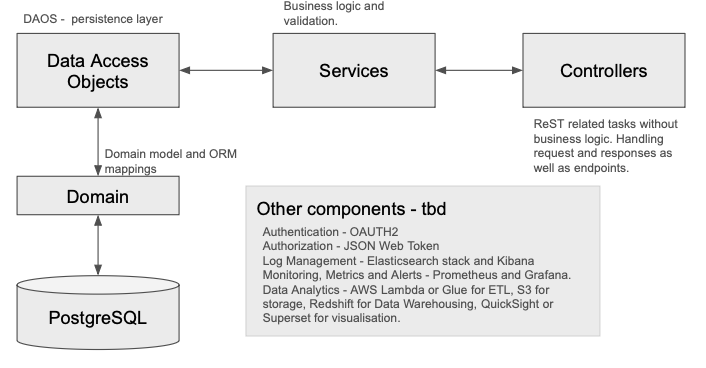

 Decisions
1. I decided to create an administrative entity to represent the bank itself. This entity is the owner of administrative accounts, i.e., accounts from which we take money or deposit money to. These accounts are important because of reporting and tracking purposes.
Also because money cannot be simply created or destroyed. It must come from somewhere and go to somewhere.
2. The money movement parts are thread safe and I lock on the account.
3. I thought about three levels of testing: unit tests, integration tests and end to end tests. The end to end tests are implemented with behave. Unit tests are implemented with pytest.

I am using docker and docker compose, but the tests can be executed locally as well (more details below).
In docker compose I configured a postgres database instance. For the tests we have sqlite in memory.
The database schema migration is managed by alembic.

## Tests
I am using pytest for the unit tests and pytest_bdd for the end to end tests with BDD. For coverage, I decided to use pytest-cov as it integrates nicely with pytest. I have used mostly unittest, coverage.py and behave (bdd) in other projects but decided to try
pytest and its ecosystem for this homework assingment.

<div style="padding: 10px; border: 2px solid gray;">
I am aware that the tests can be improved dramatically. Due to time restrictions, I have tried to just increase the coverage (although 
we know it is not a guarantee of a good testing suite). However, typically, in projects in which calculations and money movement
are done, I usually imprelement a more comprehensive test suite with things like branch coverage and mutation testing. Mutation
testing is very usefull in checking the quality of the test suite itself and helped me a lot in the past to identify issues
that my test cases hadn´t previously covered.
</div>

### Run the tests with coverage
```sh
pytest --cov=api bddtests tests
```

To run tests using Docker Compose run:
```sh
docker-compose -f docker-compose.test.yml up --buil

## Overall architecture
The diagram below located at /docs/diagram.png shows the overall architecture of the project.



## Development environment
After installing docker, build the image and start the container:
```sh
docker compose up --build
```
The server will start at 0.0.0.0:8000. You can check this by accessting the ping URL: 0.0.0.0:8000/ping
Besides the tests, there are a few http files created in the requests folder to help checking how the endpoints work. For instance:

### Create a new administrative entity
```http
### Create a administrative Entity (e.g., SYSTEM)
POST http://0.0.0.0:8000/api/v1/administrative_entity
Content-Type: application/json

{
  "corporate_name": "SYSTEM 3",
  "tax_id": "SYSTEM_TAX_ID 3"
}


### List all administrative entities
GET http://0.0.0.0:8000/api/v1/administrative-entities
```
### Bank account related endpoints - a few eamples
```http
### Create Cash Holding Account
POST http://0.0.0.0:8000/api/v1/bank-accounts
Content-Type: application/json

{
  "owner_id": 1,
  "balance": 120000.00,
  "account_type": "ADMINISTRATIVE",
  "status": "ACTIVE"
}

### Create Cash Disbursement Account
POST http://0.0.0.0:8000/api/v1/bank-accounts
Content-Type: application/json

{
  "owner_id": 1,
  "balance": 120000.00,
  "account_type": "ADMINISTRATIVE",
  "status": "ACTIVE"
}

### Create Cash Disbursement Account
POST http://0.0.0.0:8000/api/v1/bank-accounts
Content-Type: application/json

{
  "owner_id": 1,
  "account_number": "Normal Bank",
  "balance": 122.00,
  "account_type": "USER",
  "status": "ACTIVE"
}

### Get all bank accounts
GET http://0.0.0.0:8000/api/v1/bank-accounts

```
# Backlog with open points ordered by priority
1. Fix BDD tests and implement a few more end to end tests
2. Add more unit tests to increase the coverage
3. Implement authentication and authorization with OAuth2 and JWT
4. Implement a CI/CD pipeline with Github Actions
5. For the client facing endpoints like transfers, we need to implement a rate limiter
6. Implement a cache layer for the bank account balance
7. Create an operations, monitoring and alerting roadmap, for instance, Prometheus and Grafana.
8. Centralize log configuration
9. At the moment I am using docker compose for the development environment. We could use Kubernetes for the production environment.
10. Improve documentation
